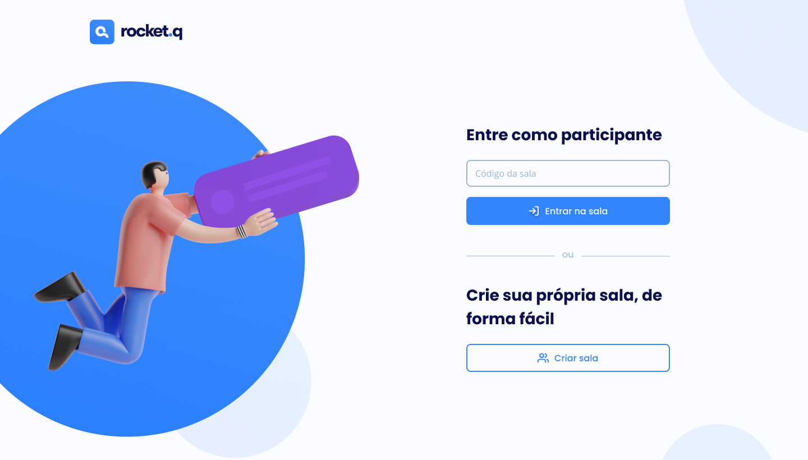

 
<a href="#-projeto">Projeto</a>&nbsp;|&nbsp;
<a href="#-tecnologias">Tecnologias</a>&nbsp;|&nbsp;
<a href="#-layout">Layout</a>&nbsp;|&nbsp;
<a href="#-licença">Licença</a>

## 📘 Projeto

Rocket.Q is a platform developed during Rocketseat's Next Level Week #6. Within the platform it is possible to create a room for anonymous users to ask questions, while the creator of the room has a password so that they can manage the questions and answer them.

## 🚀 Tecnologias

This project was developed using the following technologies/tools:

- HTML
- CSS
- Javascript
- Node.JS
- EJS
- SQLite

## 🎨 Layout

A figma layout of the project is available by clicking [here](https://www.figma.com/file/vp3iFfd1ohCbHyDX9jCiQi/Roquet.q).
